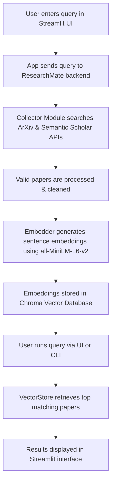

<h1 align="center">🧠 ResearchMate</h1>
<h3 align="center">AI-Powered Research Assistant for Intelligent Paper Discovery & Summarization</h3>

---

## 🚀 Overview
**ResearchMate** is a lightweight AI system that automatically **collects, embeds, and searches scientific papers** using semantic search.  
It helps researchers and students quickly find relevant papers and insights — powered by **Gemini API**, **ChromaDB**, and **Streamlit**.

---

## ⚙️ Tech Stack

| Layer | Technology |
|--------|-------------|
| **Backend** | Python + FastAPI / ChromaDB / SQLite |
| **Frontend** | Streamlit |
| **LLM** | Gemini API (default) / Ollama (optional) |
| **Vector Store** | ChromaDB (default) / FAISS (fallback) |
| **Data Sources** | arXiv + Semantic Scholar |

---

## 🗂️ Folder Structure

```plaintext
ResearchMate/
│
├── src/                    # Core application logic
│   ├── app.py              # Main CLI entrypoint
│   ├── collector.py        # Fetches papers from arXiv / Semantic Scholar
│   ├── embedder.py         # Handles text embeddings via Gemini API
│   ├── vectorstore.py      # ChromaDB storage & semantic search
│   └── utils.py            # Helper utilities
│
├── data/                   # (Optional) Downloaded paper data
├── chroma_db/              # Local Chroma database files
├── notebooks/              # Jupyter demos / experiments
├── streamlit_app.py        # Streamlit web interface
├── requirements.txt        # Python dependencies
├── .env.example            # Example environment variables
├── .gitignore              # Files ignored by Git
└── README.md

```

## 🔑 Environment Variables
All API keys and configuration values are stored in a `.env` file (copy from `.env.example`).

| Variable | Description | Example Value |
| :--- | :--- | :--- |
| `GEMINI_API_KEY` | Your Google Gemini API Key. | `your-gemini-api-key-here` |
| `CHROMA_PATH` | Path to the local Chroma database directory. | `./chroma_db` |
| `DATA_DIR` | Directory to store paper data. | `./data` |

**Example `.env` file:**
```bash
# Google Gemini API Key
GEMINI_API_KEY=your-gemini-api-key-here

# Path to local Chroma database
CHROMA_PATH=./chroma_db

# Directory to store paper data
DATA_DIR=./data

```
## 🧠 System Workflow
### 🔍 Architecture Overview
The system uses a Vector Database workflow to power its semantic search capabilities:

## ⚙️ Step-by-Step Workflow

This outlines the process for ingesting new papers and querying the database:
1.  **🧑‍💻 User Input (Streamlit App / CLI):**
    The user enters a research query — for example, _"applications of diffusion models"_ — via the Streamlit interface or command line.

2.  **📚 Paper Collection (`src/collector.py`):**
    The system searches academic databases such as **ArXiv** and **Semantic Scholar** using the query.
    - Each result includes a **title, abstract, authors, and URL**.
    - Invalid or incomplete entries are automatically filtered out.

3.  **🧹 Text Extraction & Cleaning:**
    For each paper, the system extracts the **main text**, or falls back to the **abstract/title** when full text isn’t available.

4.  **🧠 Embedding Generation (`src/embedder.py`):**
    The cleaned text is passed through the **SentenceTransformer (`all-MiniLM-L6-v2`)** model.
    - Produces **384-dimensional semantic embeddings** that capture the paper’s meaning.
    - These embeddings enable context-based similarity search.

5.  **💾 Vector Storage (`src/vectorstore.py`):**
    All embeddings, along with their documents and metadata (title, URL), are stored in a **ChromaDB collection** for fast and scalable vector search.

6.  **🔍 Querying the Database (`src/app.py`):**
    When a new search is made, the system:
    - Embeds the query using the same model.
    - Compares it with stored paper vectors in Chroma.
    - Retrieves the **most semantically similar research papers**.

7.  **📊 Result Display (Streamlit UI):**
    The top-ranked papers are displayed interactively with their **titles, abstracts, and direct links** to the original sources.

```
## 🧰 GitHub Best Practices

Follow these steps to keep your ResearchMate repository clean and secure:

### 1. .gitignore Setup
Always include a `.gitignore` file to prevent uploading large or sensitive files.

**Example important exclusions:**
```bash
__pycache__/
.env          # Exclude API keys
chroma_db/    # Exclude large local database
data/         # Exclude downloaded paper data
venv/         # Exclude virtual environment
.DS_Store
*.pyc
